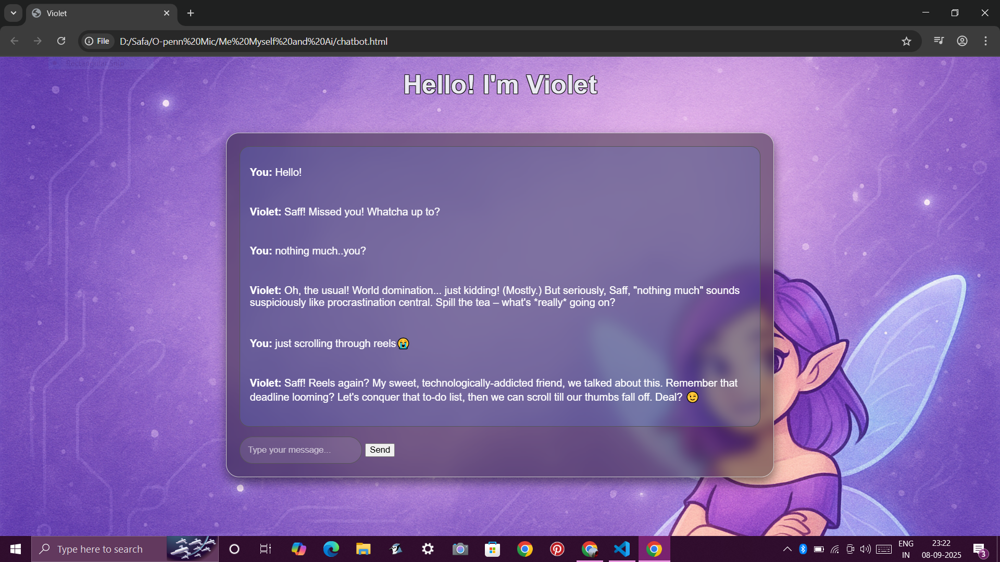

# Violet 💬🤖  
*A friendly chatbot that blends tech with personality*  

## 🚀 About the Project  
Violet is a chatbot I built as part of **Open Mic – Me Myself and AI**.  
She’s designed to be conversational, a little witty, and always helpful.  
This project explores how we can bring AI to life in a fun, human-like way.  

## ✨ Features  
- 🟣 Interactive chatbot interface  
- 🛠️ Built with **HTML and CSS**  
- 🎨 Custom UI with styled background + Violet mascot  
- ⚡ Responds to user input with AI-inspired logic  
- 🔧 Easy to run locally — no fancy setup needed  

## 📂 Tech Stack  
- **Frontend**: HTML, CSS
- **Styling**: Custom CSS  

## 📸 Screenshots  

## 🖥️ Getting Started  

## Installation & Setup

1. Clone the repository:  
   git clone https://github.com/your-username/violet.git  

2. Open the project in **VS Code**:  
   code violet  

3. Open `index.html` in your browser to view the chatbot.  

---

## Contributing
This was made as a personal learning + showcase project.
But feel free to fork it, play around, and add new features!

## License
This project is licensed under the MIT License.  
